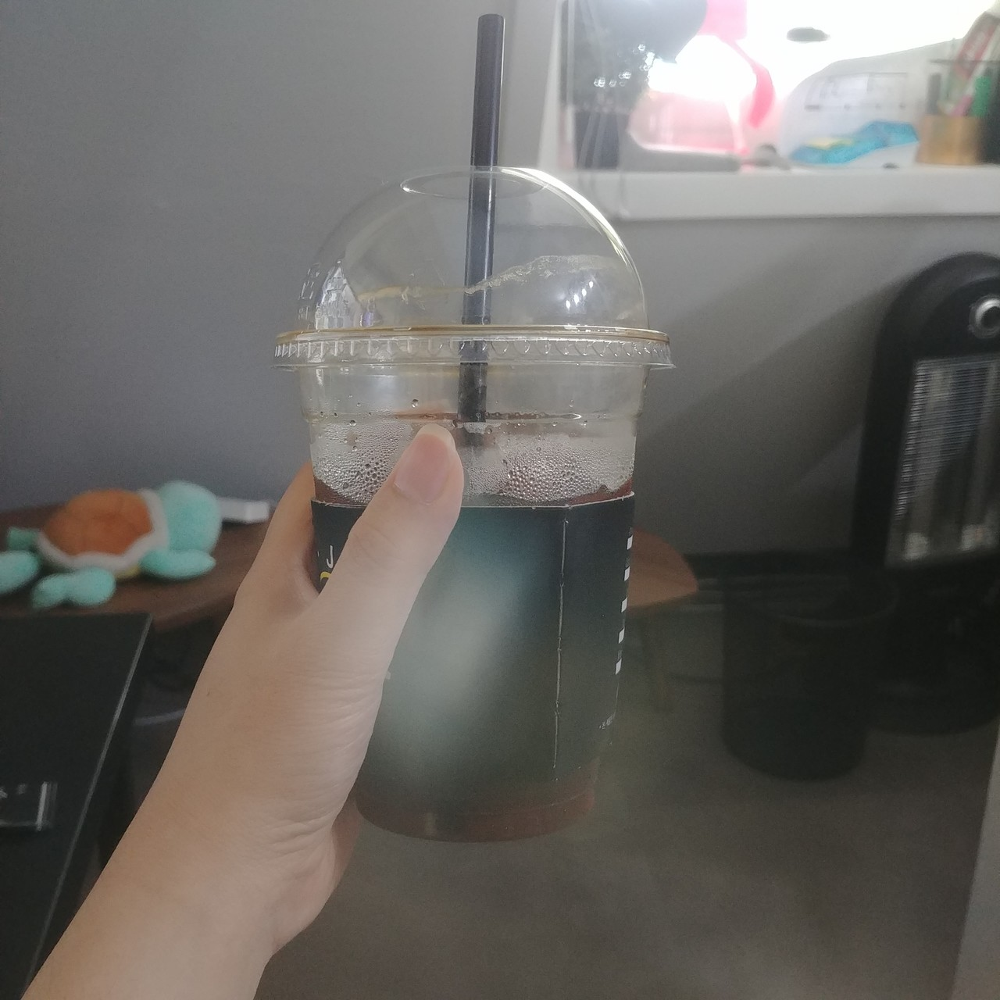
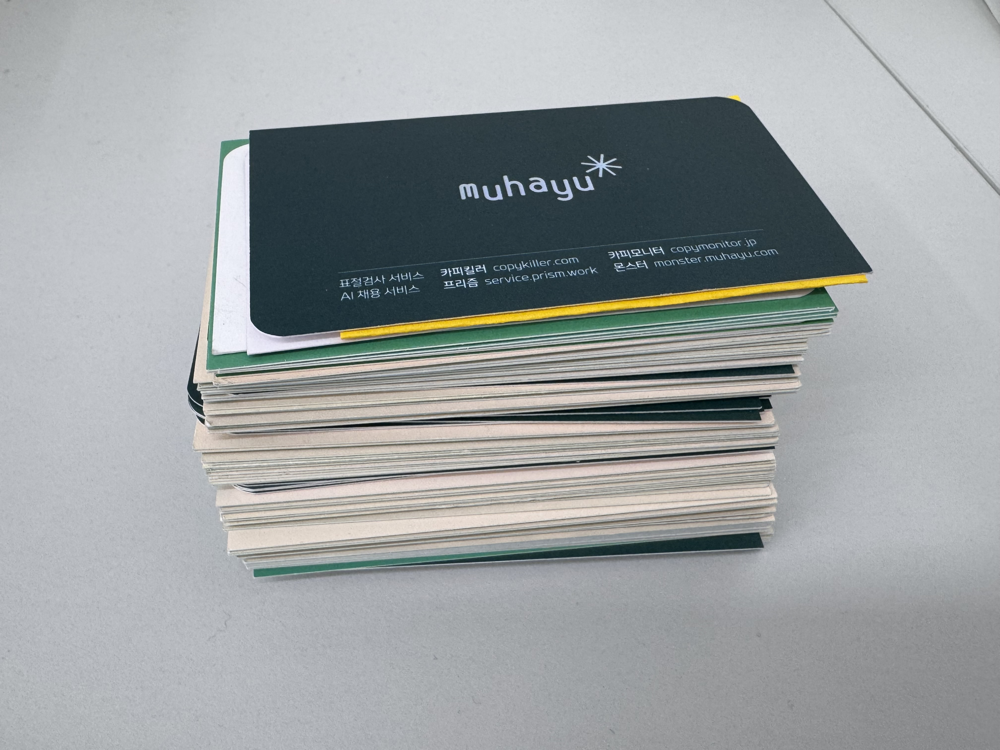

## Prologue

작년 한 해 동안의 노력과 성과를 인정받아, 올해 1월 나는 '황금열쇠'를 수여받게 되었다. 이 상은 단순히 개인의 성과를 기념하는 것을 넘어, 우리 조직이 중요하게 여기는 가치관와 태도에 가장 부합하는 이에게 수여하는 상이었다.

상을 받는 순간 나는 한 가지 결심을 했다. 
나 혼자 기뻐하고 끝내기보다, 이 기쁨을 조직 전체와 나눠야 겠다. 

그래서 사내 전체를 대상으로  **[ 전사 커피 쏘기 이벤트! ]** 이벤트를 진행했다.   

모두가 부담없이 들러 커피 한 잔씩 받아가며 웃고 떠드는 그 시간은, 단순한 다과 시간이 아닌 우리 스스로의 성취를 축하하고 응원하는 문화의 장이었다.

작지만 따뜻했던 순간들을 돌아보며, 그 안에 담긴 조직문화의 의미를 곱씹어 보며 이 글을 쓴다.

---

### 1. 황금열쇠를 수여받다.

작년 한 해 동안 나는 자리에서 꾸준히 성실하게 일해왔다. 어쩌다 보니 노력이 주목받고 인정받아, 연구소를 대표해 ‘황금열쇠’라는 뜻깊은 상을 수상하게 되었다.  
ps. 진짜 황금 3돈이다 ㅎㄷㄷ, 연구소 1명, 사업부 1명씩 수여 받았다. 

이 상은 단순한 퍼포먼스 지표로 주어지는 것뿐만이 아닌, 조직이 중요하게 여기는 가치를 몸소 실천한 이에게 주어진다.  
그래서 더욱 무게감 있고 감사한 순간이었다.  
상을 수여 받으면서 조직이 기대하는 모습이 무엇인지 다시금 깨닫고 이 기쁨을 나만의 것으로 남기고 싶지 않았다.  

---

### 2. 사내 전체를 대상으로 커피 무료나눔 이벤트를 하다.

내 성과는 나 혼자 이루어 낸 것이 아니였다.  
이 기쁨을 나 혼자 누려서는 안된다는 생각이 있었고 이를 나누기 위한 생각을 했다.

그렇게 사내 전체를 대상으로 행사를 기획하게 되었다.   
바로 **‘전사 커피 나눔 이벤트!’** 였다.   
최근에 TV 프로에서 연애인들이 팬들에게 커피를 역으로 조공하는 것을 보면서 기획하게 되었다.  

생각이 정리되니 진행은 매우 순조로웠다.  
자주 들르는 카페 사장님과 행사에 대해서 의논하고 마케팅 팀과 협의해서 행사 판넬을 작게 만들수 있었다.  
  - 마케팅 팀과 협업하는 것은 처음이였는데 행사의 의도를 들어 주시고는 흔쾌히 홍보용 판넬을 만들어 주셨다.
  - 바쁘신데도 시간내어 작업해주신 팀에 다시한번 감사 인사를 드린다. 

취지는 구성원 모두에게 감사의 의미로 하루동안 카페를 찾은 직원에게 커피를 무료로 나누자는 것이었다.  
카페 한 켠에 안내 문구를 붙이고, 누구나 부담 없이 들를 수 있도록 마련했다.  

---

### 3. 모두가 함께 즐긴 행사

행사를 공지하면서 [ "미쳤다", "이래서 열쇠를 받았나 보다", "커피를 마구 마셔서 거덜 내겠다" ] 등등 여러 이야기를 주셨던게 기억에 남는다.  

행사 당일에 카페 사장님이 판넬을 가게 이곳 저곳에 달아주셨고 덕분에 처음 방문하는 팀원들도 부담없이 행사를 참여할 수 있었다.  
판넬은 몰래 진행해 달아 둔거라 놀랐다는 반응도 있었다.

커피 한 잔의 여유 속에 피어난 대화와 웃음은 참 소중했다.  
누군가는 “이런 시간 너무 좋다”고 말했고, 누군가는 “이 분위기 자주 있었으면 좋겠다”며 웃었다.  
평소엔 서로 바빠 스쳐 지나치기만 하던 사람들이, 이 날은 커피 한 잔 앞에서 느긋하게 머물렀다. 작은 이벤트였지만, 구성원 모두가 주인공이 되는 순간이었다.  
커피를 매개로 만들어진 소통의 장은 단순한 다과 이상의 의미를 담고 있었다.

나는 이렇게 성공을 나누었다.

---

### 4. 내가 얻게 된 것들

이벤트를 하면서 정산을 위해 명함을 받았는데  
회사가 커지면서 명함 디자인이 참 많이 바뀌었다.  
이 명함이 지금 나에게는 황금 열쇠 이상의 가치이다.  
아직도 장식장에 잘 보관중이다.

행사를 진행하며 평소에 접점이 없던 동료들과도 이야기할 수 있는 기회가 있었고, 혼자가 아닌 다 같이 이루어낸 성과라는 것을 확실하게 명시할 수 있었다.

조직 전체적으로 긍정적인, 앞으로도 열심히 나아가자 하는 분위기를 만들어서 좋았다.

이런 행사를 할 수 있었다는 것이 내게 가장 큰 선물이었다.  
나에게 이런 기회가 주어졌다는 것에 감사한다.

---
